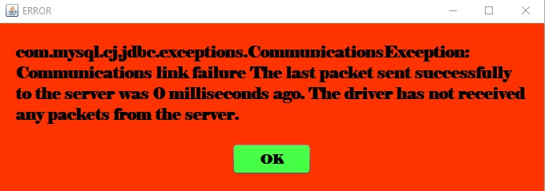
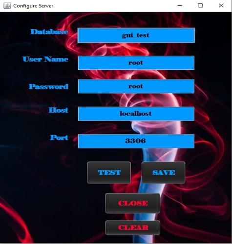
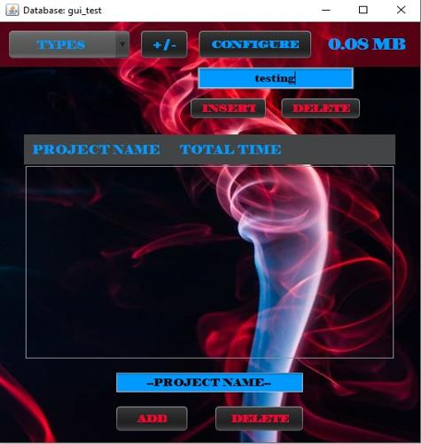
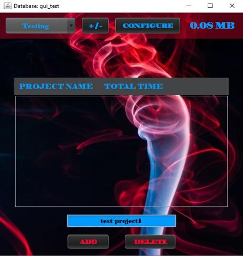
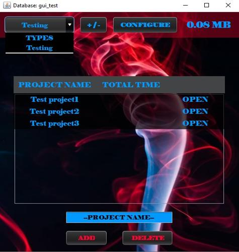
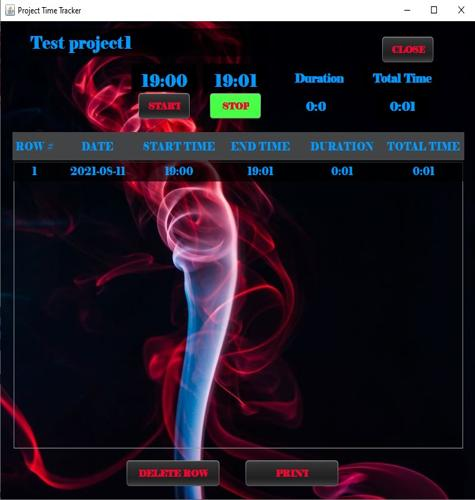
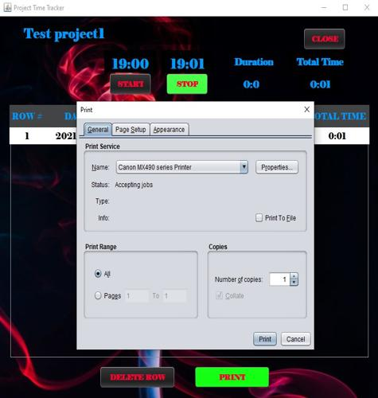

<h1 align="center">Welcome to Time Tracking GUI</h1>

<!--  -->

<h4 align="center">
  Java Swing: This program helps track time of projects.  The projects are listed under a type.  Once a type and project is selected, then you are able to start and stop the amount of time.  A database needs to be setup since the information is stored in a database.  Open and read the README-2.TXT file on how to properly setup your database.  Once your database is setup, then click on CONFIGURE button and enter in the correct values to connect to your database.
</h4>
 

<h2 align="center" style="text-decoration: underline;">Using this GUI is as follows:</h2>

<h4 align="center">
    1. The very first time using this program, you will have an error.  Do not worry, simply click on OK and then CONFIGURE from the main window.  This does not have to be done every time you run the program.  Once the server is configured, it is saved in a local file to be used next time you run the program.  

  <!--  -->
</h4>

<h4 align="center">
    2. These are just default values that I have setup.  If you are using mamps, odds are that all you need to do is change the database name.  If you are using a server, simple clear the form and enter the required values.  Click on TEST to test the connection with your server.  If you get a success, then SAVE before clicking on CLOSE.

  <!--  -->
</h4>

<h4 align="center">
    3. Now that you have a good connection with your server, click on +/- button to enter in a type of project. If you ever want to delete a type of project, enter in the type of project and click on DELETE.  A confirmation will appear if you would like to delete.  Be careful though, deleting a type will also delete every project and time related to that type.   

  <!--  -->
</h4>

<h4 align="center">
    4. Lets now add a project.  The drop down menu in the upper left hand corner will display which type of project is selected.  Near the bottom, enter in a project then click ADD.  To delete a project, either type in the project and click DELETE or click on the project name to delete, then click on DELETE button.   

To open a project to start logging time, click on OPEN.

  <!--  -->
</h4>

<h4 align="center">
    5. Click on START to start the time.  Once finished then simply click on STOP.  When you click on STOP, a new row will be added to the table and also inserted into your database.  The Total Time under the CLOSE button will display the total amount of time that has been logged on this project. Once you are finished, click on the CLOSE button to exit and return to the main window.  

</h4>

<h4 align="center">
    6. If you would like to print out all the times that have been logged, simply click on the PRINT button.  A print window will appear and select your printer to use and how you would like the print.  It will print all the rows in the table, aligned under each header.     

</h4>

<!-- For more details see [GitHub Flavored Markdown](https://guides.github.com/features/mastering-markdown/). -->
<!-- You can use the [editor on GitHub](https://github.com/zuki07/Load_file/edit/master/README.md) to maintain and preview the content for your website in Markdown files. -->
