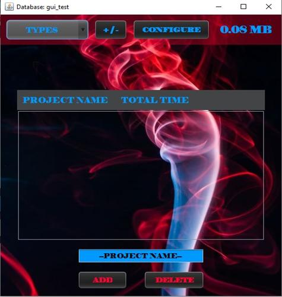
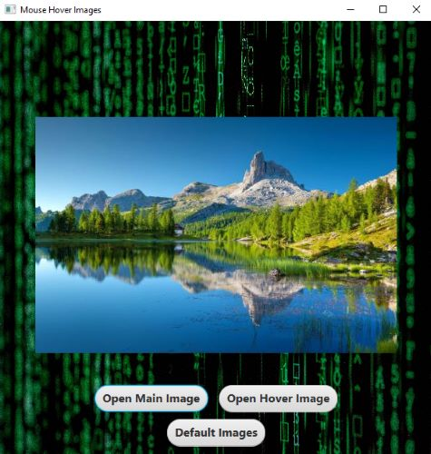
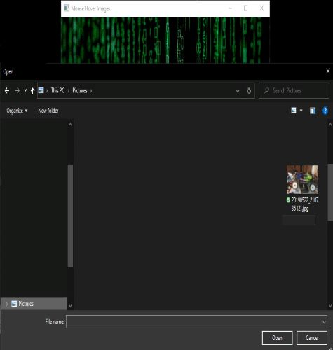
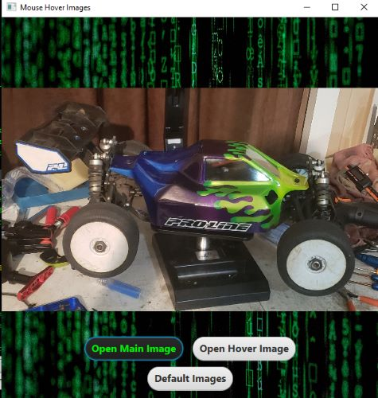

<h1 align="center">Welcome to Hover Image</h1>

<!--  -->

<h4 align="center">
  Javafx: hover over the image for it to change.  The open main image and open hover image buttons will open the file explorer for you to change the images.  The default button sets the images to what they originally were.
</h4>
 

<h2 align="center" style="text-decoration: underline;">Using this GUI is as follows:</h2>

<h4 align="center">
    1. Hovering the mouse over the image will change the image.  Hover off the image will change it back.  

  <!--  -->
</h4>

<h4 align="center">
    2. Clicking on Open Main Image button will open the file explorer to select a different image.  Same applies to the Open Hover Image button.

  <!--  -->
</h4>

<h4 align="center">
    3. Clicking on the Default Images button will reset the images back to their deafult state.  

  <!--  -->
</h4>

<!-- For more details see [GitHub Flavored Markdown](https://guides.github.com/features/mastering-markdown/). -->
<!-- You can use the [editor on GitHub](https://github.com/zuki07/Load_file/edit/master/README.md) to maintain and preview the content for your website in Markdown files. -->
